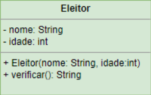

<h1>Eleitor 1.0</h1>

Desenvolver uma classe chamada <code>Eleitor</code> com os atributos: <code>nome</code> e <code>idade</code>
e os métodos conforme a representação gráfica abaixo.

Os atributos devem ser privados e devem ser acessados via propriedades.

    

O método Verificar retorna à situação do eleitor conforme a sua idade, seguindo as regras:
- Idade menor que 16 anos: "<i>nome do eleitor</i> ainda não pode votar. Tem apenas <i>idade</i>>";
- Idade igual ou superior a 18 anos e menor ou igual a 65 anos: "<i>nome do eleitor</i> - <i>idade</i> deve votar.";
- Idade entre 16 e 18 anos e superior a 65 anos: "<i>nome do eleitor</i> - <i>idade</i>> Voto facultativo.";

Crie objetos da classe <code>Eleitor</code> com várias idades e imprima a sua situação.
