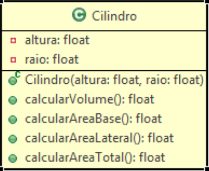

<h1>Cilindro</h1>

Um cilindro é definido por sua altura e raio. Assim, na classe Cilindro, descreva os algoritmos
dos métodos para calcular o volume, a área da base, a área lateral e a área total.

    

<ul>
    <li>Volume = PI * raio2 * altura</li>
    <li>Área Base = PI * raio2</li>
    <li>Área Lateral = 2 * PI * raio * altura</li>
    <li>Área Total = 2 * Área Base + Área Lateral</li>
</ul>