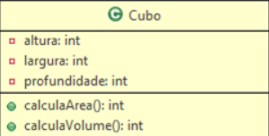

<h1>Cubo</h1>

Crie a classe conforme a representação gráfica abaixo. No construtor da classe devem ser passados os valores para os atributos privados:
altura, largura e profundidade. E deve ser criados propriedades para acessar os valores dos atributos. Na classe Cubo, implemente os métodos:
<code>calculaArea()</code> e <code>calculaVolume()</code> conforme as regras.

  

<ul>
  <li>A área do cubo = altura * largura.</li>
  <li>O volume do cubo = altura * largura * profundidade.</li>
</ul>
